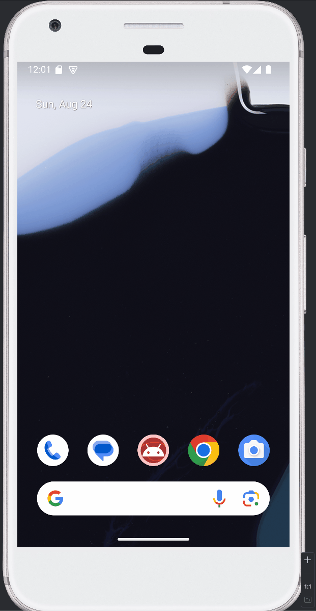

# Android Prework - *Demo Showcase*

Submitted by: **Ian Acosta**

**Demo Showcase** is an android app that shows an image and introductory message, and allows pressing a button to display a Toast.

Time spent: **2** hours spent in total

## Required Features

The following **required** functionality is completed:

* [✅] Image and introductory message displayed on screen
* [✅] Button displayed on screen
* [✅] Toast with message appears when button is pressed

The following **optional** features are implemented:

* [✅] Change app icon

## Video Walkthrough

Here's a walkthrough of implemented features:

GIF created with [ScreenToGif](https://www.screentogif.com/) for Windows

## Notes

Some challenges included were trying to include some more customizable
splash screens, and it really depended on what versions the app is using, which 
complicated things. It was really mostly just trying to match up the current supported
resources with their corresponding versions in order for the app to not crash every so often.

## License

    Copyright [2025] [Ian Acosta]

    Licensed under the Apache License, Version 2.0 (the "License");
    you may not use this file except in compliance with the License.
    You may obtain a copy of the License at

        http://www.apache.org/licenses/LICENSE-2.0

    Unless required by applicable law or agreed to in writing, software
    distributed under the License is distributed on an "AS IS" BASIS,
    WITHOUT WARRANTIES OR CONDITIONS OF ANY KIND, either express or implied.
    See the License for the specific language governing permissions and
    limitations under the License.